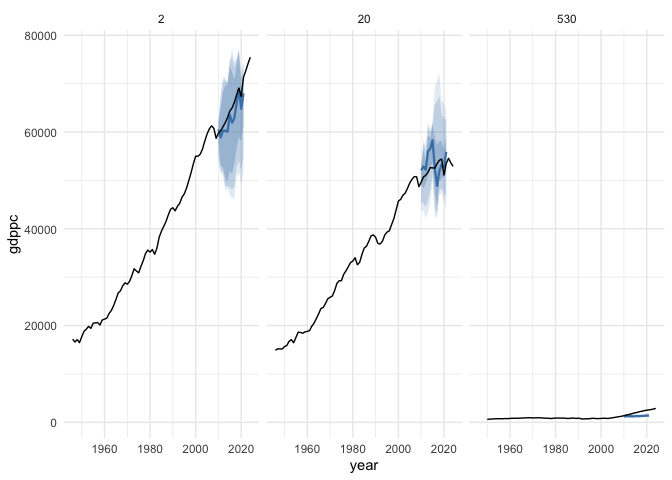
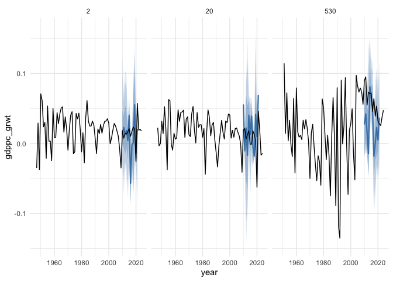
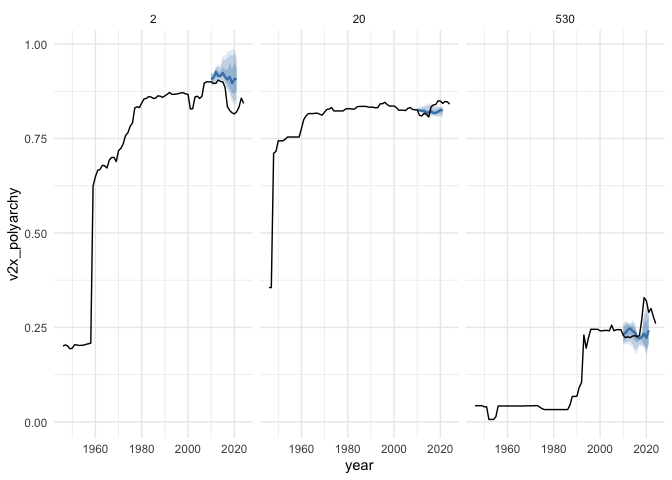

<!-- README.md is generated from README.Rmd. Please edit that file -->

# endogenr

<!-- badges: start -->

<!-- badges: end -->

The goal of `endogenr` is to make it easy to simulate dynamic systems
from regression models, mathematical equations, and exogenous inputs
(either based on a stochastic distribution, or given by some data). It
assumes a panel-data structure with two columns identifying the time and
the unit dimensions.

The simulator identifies the dependency graph of the models added to the
system and derives the order of calculation from that graph. Parallel
execution is opt-in via the `future` package.

## Installation

You can install the development version of `endogenr` from
[GitHub](https://github.com/) with:

``` r
# install.packages("pak")
pak::pak("prio-data/endogenr")
# alternatively with
renv::install("prio-data/endogenr")
```

You can also clone the repository, open it as a project in RStudio, find
the “Build” tab, and press “Install”.

## Example

`setup_simulator()` accepts a plain `data.frame` or `data.table` — no
`tsibble` conversion is required. Formula RHS terms can use `lag()`,
`zoo::rollmean()`, or any function you define yourself (pass user
functions through the `globals` argument).

``` r
library(endogenr)
library(dplyr)
#> 
#> Attaching package: 'dplyr'
#> The following objects are masked from 'package:stats':
#> 
#>     filter, lag
#> The following objects are masked from 'package:base':
#> 
#>     intersect, setdiff, setequal, union
df <- endogenr::example_data

# Drop units with any NA in modelled outcomes over the training window 1970–2009.
required <- c("gdppc", "gdppc_grwt", "best", "v2x_polyarchy", "psecprop", "population")
train_window <- df[df$year >= 1970 & df$year <= 2009, ]
ok <- aggregate(train_window[, required],
                by = list(gwcode = train_window$gwcode),
                FUN = function(x) all(!is.na(x)))
keep <- ok$gwcode[apply(ok[, required], 1, all)]
df   <- df[df$gwcode %in% keep, ]
df$gdp <- df$gdppc * df$population  # derived outcome; pre-computed so the initial state is non-NA

c1 <- best ~ lag(best) + lag(log(gdppc)) + lag(log(population)) +
  lag(psecprop) + lag(v2x_polyarchy) + lag(gdppc_grwt) +
  lag(zoo::rollmean(best, k = 5, fill = NA, align = "right"))

model_system <- list(
  build_model("deterministic", formula = gdppc ~ I(abs(lag(gdppc) * (1 + gdppc_grwt)))),
  build_model("deterministic", formula = gdp ~ I(abs(gdppc * population))),
  build_model("parametric_distribution", formula = ~gdppc_grwt, distribution = "norm"),
  build_model("linear", formula = c1, boot = "resid"),
  build_model("univariate_fable",
              formula = v2x_polyarchy ~ error("A") + trend("N") + season("N"),
              method = "ets"),
  build_model("exogen", formula = ~psecprop),
  build_model("exogen", formula = ~population)
)
```

### Validation

`setup_simulator()` runs `validate_panel()` and
`validate_system_closure()` on your inputs before fitting anything.
These check that the panel is balanced, time is contiguous and
integer-valued, the initial state at `test_start - 1` has no NAs in any
modelled outcome, and every variable referenced by a formula is either
modelled or supplied as a column. See `?validate_panel` and
`?validate_system_closure` if you want to run them ad-hoc on a candidate
panel.

``` r
simulator_setup <- setup_simulator(
  models      = model_system,
  data        = df,
  train_start = 1970,
  test_start  = 2010,
  horizon     = 12,
  groupvar    = "gwcode",
  timevar     = "year",
  inner_sims  = 2,
  min_window  = 10
)
```

### Parallel execution and progress

The simulator no longer manages a `future` plan internally. Set one
yourself before calling `simulate_endogenr()`, and wrap the call in
`progressr::with_progress()` if you want a progress bar:

``` r
future::plan(future::multisession, workers = 2)

set.seed(42)
progressr::with_progress({
  res <- simulate_endogenr(nsim = 2, simulator_setup = simulator_setup)
})

future::plan(future::sequential)
```

### Scoring and plotting

`simulate_endogenr()` stamps `panel_unit` / `panel_time` attributes on
the result so `get_accuracy()` and `plotsim()` can infer the panel
context without any further configuration. Filter to the forecast window
using a plain `data.table` predicate.

``` r
res <- res[res$year >= simulator_setup$test_start, ]

acc <- get_accuracy(res, "gdppc_grwt", df)
acc |>
  dplyr::summarize(dplyr::across(crps:winkler, ~ mean(.x))) |>
  dplyr::arrange(crps) |>
  knitr::kable()
```

|      crps |       mae |   winkler |
|----------:|----------:|----------:|
| 0.0348409 | 0.0435349 | 0.1434817 |

``` r

plotsim(res, "gdppc", c(2, 20, 530), df)
#> Warning: Removed 4 rows containing missing values or values outside the scale range
#> (`geom_line()`).
```



``` r
plotsim(res, "gdppc_grwt", c(2, 20, 530), df)
#> Warning: Removed 7 rows containing missing values or values outside the scale range
#> (`geom_line()`).
```



``` r
plotsim(res, "v2x_polyarchy", c(2, 20, 530), df)
```



## Spatial lag

`endogenr` supports spatial-lag variables in the simulation. The setup
is two steps: (1) compute the spatial lag for the historical data, and
(2) register a `spatial_lag` model in the system so the lag is
recomputed at each simulated time step.

### Step 1: prepare spatial weights and the historical lag

`st_weights_from_sf()` builds a neighbourhood list and weights from an
`sf` object. The default is queen contiguity. For other schemes, call
`sfdep` directly and supply `nb`, `wt`, and `unit_ids` yourself (in the
order they appear in the spatial object).

Computing the historical lag can be fiddly when the panel is unbalanced
or has missing observations; the example below filters to units present
in the neighbourhood structure before computing the lag.

``` r
library(endogenr)
library(dplyr)

df <- endogenr::example_data

# Load a map and filter to units present in the data
map <- poldat::cshp_gw_modifications(france_overseas = FALSE) |>
  dplyr::filter(end == as.Date("2019-12-31"))
map <- map |> dplyr::filter(gwcode %in% unique(df$gwcode))

# Build spatial weights (queen contiguity by default)
sf::sf_use_s2(FALSE)
neigh <- st_weights_from_sf(map, "gwcode", weights_args = list(allow_zero = TRUE))

# Compute the spatial lag of `best` for each year in the historical data
df <- df |>
  dplyr::filter(gwcode %in% neigh$unit_ids) |>
  dplyr::group_by(year) |>
  dplyr::mutate(
    sl_best = sfdep::st_lag(best, neigh$nb, neigh$wt, allow_zero = TRUE)
  ) |>
  dplyr::ungroup()
```

### Step 2: add a `spatial_lag` model to the system

A `spatial_lag` model is a cross-sectional transformation applied at
every simulated `t`. Reference the lag in other formulas as `lag(sl_y)`
— using the same-period value `sl_y` would create a circular dependency.

``` r
c1 <- best ~ lag(best) + lag(sl_best) + lag(log(gdppc)) +
  lag(log(population)) + lag(psecprop) + lag(v2x_polyarchy) + lag(gdppc_grwt) +
  lag(zoo::rollmean(best, k = 5, fill = NA, align = "right"))

model_system <- list(
  # spatial_lag recomputes sl_best from `best` at each simulated t
  build_model("spatial_lag", formula = sl_best ~ best,
              nb = neigh$nb, wt = neigh$wt, unit_ids = neigh$unit_ids,
              island_default = 0),
  build_model("deterministic", formula = gdppc ~ I(abs(lag(gdppc) * (1 + gdppc_grwt)))),
  build_model("deterministic", formula = gdp ~ I(abs(gdppc * population))),
  build_model("parametric_distribution", formula = ~gdppc_grwt, distribution = "norm"),
  build_model("linear", formula = c1, boot = "resid"),
  build_model("univariate_fable",
              formula = v2x_polyarchy ~ error("A") + trend("N") + season("N"),
              method = "ets"),
  build_model("exogen", formula = ~psecprop),
  build_model("exogen", formula = ~population)
)

simulator_setup <- setup_simulator(
  models      = model_system,
  data        = df,
  train_start = 1970,
  test_start  = 2010,
  horizon     = 12,
  groupvar    = "gwcode",
  timevar     = "year",
  inner_sims  = 2,
  min_window  = 10
)

future::plan(future::multisession, workers = 2)
set.seed(42)
progressr::with_progress({
  res <- simulate_endogenr(nsim = 2, simulator_setup = simulator_setup)
})
future::plan(future::sequential)
```

## Long-horizon comparison

For each horizon `h`, the long-horizon API fits a single *direct* regression of
the h-step-ahead outcome on covariates observed at the forecast origin
(`test_start - 1`, the last observed period — the same information the dynamic
simulator conditions on). It is a reduced-form benchmark for the dynamic
simulator. See `?cv_long_horizon` for the cross-validated entry point.

The outcome on the formula LHS must be wrapped in `lead_horizon()`; the horizon
`h` is supplied internally per horizon. The RHS is evaluated at the origin, so
write the covariates *unlagged* for the standard benchmark (use `lag()` only
when you deliberately want history older than the origin).

``` r
formulas <- list(
  lh_linear = lead_horizon(gdppc_grwt) ~ gdppc_grwt + log(gdppc) + best
)

lh_setup <- setup_long_horizon(
  data       = df,
  formulas   = formulas,
  horizons   = 1:12,
  groupvar   = "gwcode",
  timevar    = "year",
  test_start = 2010
)

lh_forecasts <- forecast_long_horizon(
  lh_setup,
  data       = df,
  test_start = 2010,   # defaults to lh_setup$test_start
  nsim       = 100,
  inner_sims = 10
)

# Score both approaches on the same (unit, horizon) grid, then stack them.
lh_acc  <- get_lh_accuracy(lh_forecasts, df, lh_setup)
sim_acc <- get_accuracy(res, "gdppc_grwt", df,
                        test_start = 2010, by = c("gwcode", "horizon"))

compare_approaches(lh_acc, sim_acc) |>
  dplyr::group_by(approach, horizon) |>
  dplyr::summarize(crps = mean(crps), .groups = "drop") |>
  dplyr::arrange(horizon, approach)
```


For a transformed outcome (e.g. `lead_horizon(asinh(gdppc)) ~ ...`), score on
the modelled scale with `get_lh_accuracy(..., scale = "model")`, or on the
native scale with `scale = "native", inverse = sinh`.
