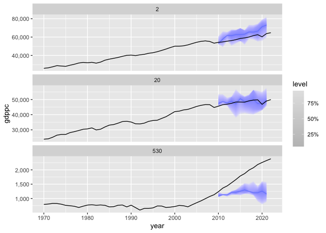
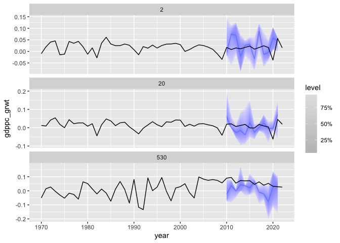
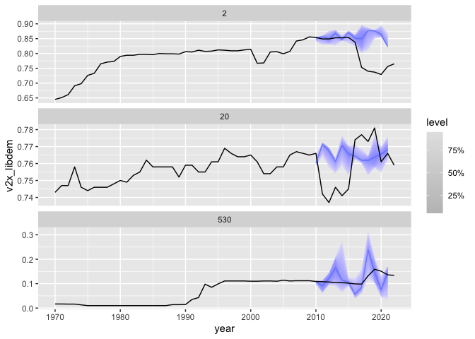
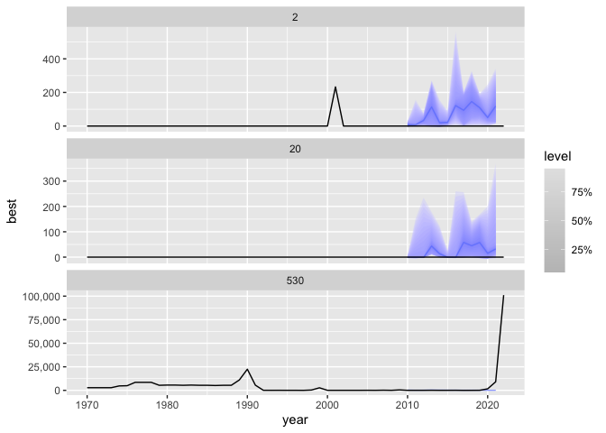

<!-- README.md is generated from README.Rmd. Please edit that file -->

# endogenr

<!-- badges: start -->
<!-- badges: end -->

The goal of endogenr is to make it easy to simulate dynamic systems from
regression models, mathematical equations, and exogenous inputs (either
based on a stochastic distribution, or given by some data). We assume a
panel-data structure, with two variables denoting the time and the space
dimensions.

The simulator works by identifying the dependency graph of the models
added to the system, and deriving the order of calculation based on this
graph.

It works with parallel simulation using the future::multisession
approach.

## Installation

You can install the development version of endogenr from
[GitHub](https://github.com/) with:

``` r
# install.packages("renv")
renv::install("prio-data/endogenr")
```

You can also clone (download) the repository, open it as a project in
RStudio, find the “Build” tab, and press “Install”.

## Example

``` r
library(endogenr)

library(dplyr)
#> 
#> Attaching package: 'dplyr'
#> The following objects are masked from 'package:stats':
#> 
#>     filter, lag
#> The following objects are masked from 'package:base':
#> 
#>     intersect, setdiff, setequal, union
df <- endogenr::example_data
df <- tsibble::as_tsibble(df, key = "gwcode", index = "year")
#> Registered S3 method overwritten by 'tsibble':
#>   method               from 
#>   as_tibble.grouped_df dplyr

e1 <- gdppc_grwt ~ lag(yjbest) + lag(gdppc_grwt) + lag(log(gdppc)) + lag(psecprop) + lag(zoo::rollmean(gdppc_grwt, k = 3, fill = NA, align = "right"))
c1 <- yjbest ~ lag(yjbest) + lag(log(gdppc)) + lag(log(population)) + lag(psecprop) + lag(dem) + lag(gdppc_grwt) + lag(zoo::rollmean(yjbest, k = 5, fill = NA, align = "right"))
d1 <- dem ~ lag(dem) + lag(gdppc_grwt) + lag(log(gdppc)) + lag(yjbest) + lag(psecprop) + lag(zoo::rollmean(dem, k = 3, fill = NA, align = "right"))

model_system <- list(
  build_model("deterministic",formula = gdppc ~ I(abs(lag(gdppc)*(1+gdppc_grwt)))),
  build_model("deterministic", formula = gdp ~ I(abs(gdppc*population))),
  build_model("parametric_distribution", formula = ~gdppc_grwt, distribution = "norm"),
  build_model("linear", formula = c1, boot = "resid"),
  build_model("univariate_fable", formula = dem ~ error("A") + trend("N") + season("N"), method = "ets"),
  build_model("exogen", formula = ~psecprop),
  build_model("exogen", formula = ~population)
)

simulator_setup <- setup_simulator(models = model_system,
                                   data = df,
                                   train_start = 1970,
                                   test_start = 2010,
                                   horizon = 12,
                                   groupvar = "gwcode",
                                   timevar = "year",
                                   inner_sims = 2,
                                   min_window = 10)

set.seed(42)
res <- simulate_endogenr(nsim = 2, simulator_setup = simulator_setup, parallel = F)

# Example that you can back-transform variables you have simulated as transformed variables
scaled_logit <- function(x, lower=0, upper=1){
  log((x-lower)/(upper-x))
}
inv_scaled_logit <- function(x, lower=0, upper=1){
  (upper-lower)*exp(x)/(1+exp(x)) + lower
}
my_scaled_logit <- fabletools::new_transformation(scaled_logit, inv_scaled_logit)

yj <- scales::transform_yj(p = 0.4) # This was transformed using lambda 0.4 when creating the data.
# Back-transform
res <- res |> dplyr::mutate(v2x_libdem = inv_scaled_logit(dem),
                            best = yj$inverse(yjbest))

res <- tsibble::tsibble(res, key = c(simulator_setup$groupvar, ".sim"), index = simulator_setup$timevar) |>
  dplyr::filter(year >= simulator_setup$test_start)

acc <- get_accuracy(res, "gdppc_grwt", df)
#> Warning: The dimnames of the fable's distribution are missing and have been set
#> to match the response variables.
acc |> summarize(across(crps:winkler, ~ mean(.x))) |> arrange(crps) |> knitr::kable()
```

|      crps |     mae |   winkler |
|----------:|--------:|----------:|
| 0.0344579 | 0.04324 | 0.1501716 |

``` r

plotsim(res, "gdppc", c(2, 20, 530), df)
```



``` r
plotsim(res, "gdppc_grwt", c(2, 20, 530), df)
```



``` r
plotsim(res, "v2x_libdem", c(2, 20, 530), df)
```



``` r
plotsim(res, "best", c(2, 20, 530), df)
```



# Funder
This work has been completed with support from the European Union through European Research Council (ERC) grant no. 101055133 (POLIMPACT). Views and opinions expressed are however those of the authors only and do not necessarily reflect those of the European Union or the ERC. Neither the European Union nor the granting authority can be held responsible for them.
